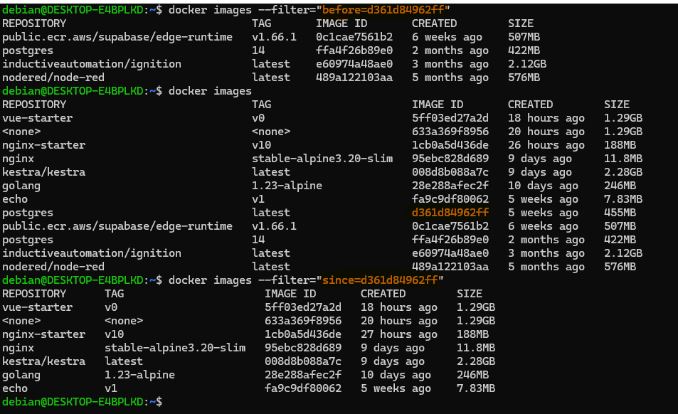
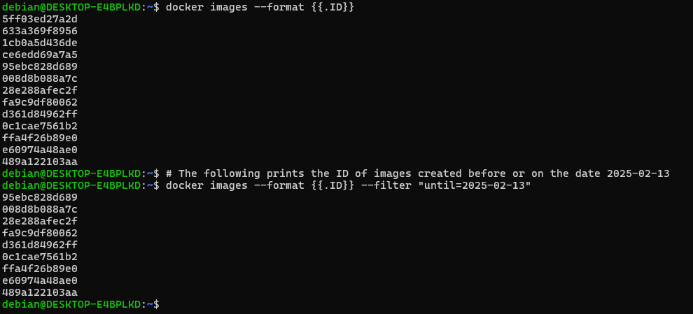
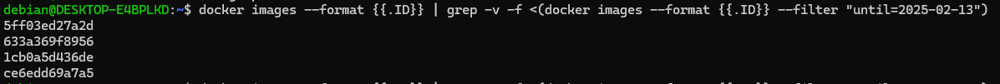
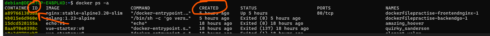
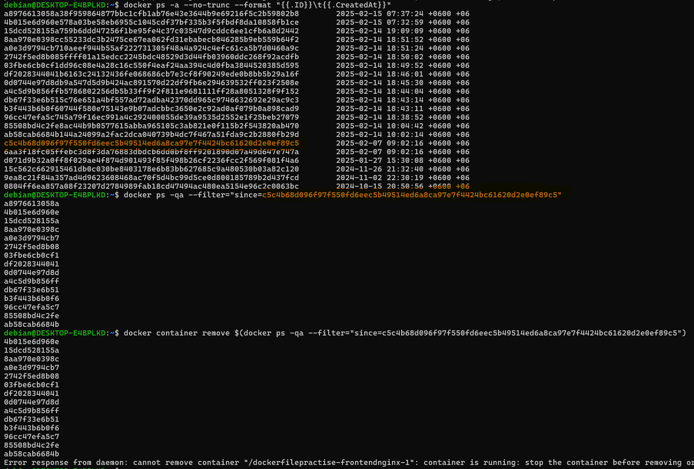
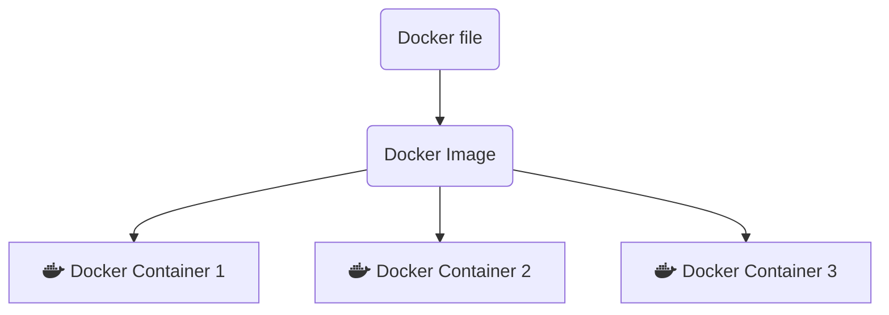

## Why use a container engine( Docker, [Podman](https://docs.podman.io/en/latest/index.html) ) **instead of** traditional Virtual Machine( via VMWare, Virtualbox) ?
**=>**
Goal: Seperate the different concerns of a project (front-end, backend, database).  
  
In traditional approach each app needs a seperate guest-os, meaning more overhead, resource-lock etc. (todo)  
But in Containers approach, a 'container engine' seperates the concerns such as 'each app and its package' can be seperated and still can have what it needs(abstractions, api calls)

`docker run nginx`

=> This will download(if not found in local cache) **nginx image** from docker hub, **create and run a new container** . This will _start_ an nginx server(default port 80). But in browser _localhost:80_ will not work. We need to expose our local machine's port that will point to Docker instance.

`docker ps`  
this is a 'task manager' for docker. Shows _running_ instances.

`docker ps -a`  
Shows history of all container apps...  

`docker logs NAME` or `docker logs -f NAME`  
=> This will output the logs of a running container named NAME. Use -f flag to stream the logs continuously.

`docker run -p 5000:80 nginx`  
Connect host computer's port 5000 to the exposed internal port 80 (from nginx' docs, we know its port is 80)

**Most Used**  
`docker run -it nodered/node-red --name noderedd -p 1880:1880 -anotherHostPort:anotherInternalPort -v node_red_docker_data:/data  `  
- _--name noderedd_ : the container is given a name
- Here the image is _nodered/node-red_ (downloaded from docker hub)
- -v node_red_docker_data:/data => The _data_ folder inside the container is mounted to a folder named _node-red_docker_data_. The named volume is found here: **\\wsl$\docker-desktop\mnt\docker-desktop-disk\data\docker\volumes** ! Note that _here_ we are binding the _/data_ directory of our node-red container to a _directory inside docker's own installation inside wsl_, instead of a folder in our own machine(e.g. C:\Documents\...).  

  
Above 2 images correspond to this flag: `-v node_red_docker_data:/data`
The following image is another example. We can make a text file from  the host machine's file explorer, it will show in the _connected_ container volumne directory:  

  

- **-it flag**
    >-i or --interactive:  
    When you type docker run -i this means that your terminal will transfer your input to container (app in container) until you press ctrl-D (leave container). For example, if some app works in container that waits for user input you can type something and that will be forwarded to the app.  
    -t or -tty (Pseudo-TTY):  
    If you add this flag, your container's output is attached to your terminal. Seems it mostly about formatting output (for bin/bash, for example - try ls with and without -t flag), but sometimes is more important because some apps change their behaviour depending on being launched via terminal or not (text editors, for example, or mechanism of masking password with * implemented by terminal).  
- **-rm flag**
  => After working with the container, when the container is stopped with 'docker stop' command then the container is removed. But if a -v flag is used, then the data persists. If **/tmp** directory is used like this `-v /tmp/mysql-data:/var/lib/mysql` then the volume wont be visible, it will persist between container restarts, but it will not persist when the machine restarts.
   Following is when /tmp dir is used:
  

**Stop, Remove Image and Container**  

We have to specify the containerID or Container Name or the Image ID
`docker ps` or `docker container ls` gives us containerID and NAME. 
`docker images` or `docker image ls` gives us ImageID.

**To remove a container, first we have to stop it:**
`docker kill NAME` or `docker stop NAME`  
=>Forcefully shuts down Immediately(SIGKILL signal) **or** stop gracefully(SIGTERM, 10sec later SIGKILL) the container with name NAME.
We have to run `docker ps` and know its NAME(far-right) column.  
 
`docker rm <container_id>`  
Removes a stopped container

`docker rm -f <container_id>`  
Forces the removal of a running container (uses SIGKILL)

`docker rmi <image_id>`  
Removes an image. Will fail if there is a running instance of that image i.e. container

`docker rmi -f <image_id>`  
Forces removal of image even if it is referenced in multiple repositories, i.e. same image id given multiple names/tags. Will still fail if there is a docker container referencing image  

  
**Combine docker ls and remove commands: Removing mutliple image/containers**

if there are 3 test nginx containers and all of them have "nginx" in their verbose names.=>  
`docker container stop $(docker container ls -q --filter name=*nginx*)`. **Works in powershell only, $() not supported in cmd**  

**Use Case**  
The following container are running and needs to forefully shutdown and the images removed.

`docker ps -q --filter name=supabase*`  
Applies filter on NAMES column, this command will only print the containerID column because of -q(quiet) flag  
  

`docker ps --filter name=supabase* --format "table {{.ID}}\t{{.Names}}"`  
We can also omit quiet flag and use --format.  
[docs about format flag](https://docs.docker.com/engine/cli/formatting/#json)  
[docs about filter flag](https://docs.docker.com/reference/cli/docker/container/ls/#filter)  
  

To simply stop all containers: `docker kill $(docker ps -q)`. **Works in powershell only, \$() not supported in cmd**  
Then remove all 'supabase' containers: `docker rm $(docker ps -aq --filter name=supabase*)`  
  

**To remove all images:**  
There is a catch. We can filter on the 'repository' field but we need to use the word 'reference' instead of 'repository'; we can mention the tag field as well. Secondly, the filter wildcard is not working with this syntax...  

It seems that wildcards are not working as expected. But only specifying * and nothing else shows 'nginx'.  
The catch is that if repository contains a slash, we have to include this in the search pattern. [see relevent github comment](https://github.com/docker/cli/issues/1332#issuecomment-441082261)

The supabase imamges have 2 slash, nginx has 0 slash, thats why it matched, and all other did not.  
  

`docker images --filter=reference='*\/supabase\/*'` Note: the slash **/** has to be escaped with a backslash **\\**  
And finally delete the images in _windows powershell_ with `docker rmi $(docker images -q --filter=reference='*\/supabase\/*')`  

** To remove specific images, using a timestamp**    
Alternate: instead of timestamp, filter on before=ID  
 

We can delete old images using 'until' filter.  
Before deleting we first  list and see what will be deleted: `docker images  --filter "until=2025-02-13"`   
Then: `docker prune --filter "until=2025-02-13"`  
What if:  
I want to delete recent images, not old ones? as per docs, we could assign labels at first and use filtering on labels:  
>label (label=<key>, label=<key>=<value>, label!=<key>, or label!=<key>=<value>) - only remove images with (**or without, in case label!=... is used**) the specified labels.  

Workaround:  
The set of 'all images' _minus_ the set of 'all images until the date':  
  
  
Then wrap the entire thing within $()  

`docker rmi $(docker images --format {{.ID}} | grep -v -f <(docker images --format {{.ID}} --filter "until=2025-02-13"))`  

- Error: Error response from daemon: conflict: unable to delete 5ff03ed27a2d (must be forced) - image is being used by stopped container bc8f2bae1771

** To remove specific containers, using filter**    

To filter by ID we need the full id, not the default truncated one.  
  
**Also note that the column names are different than what we are using inside the filter, 'CreatedAt' instead of 'CREATED', to get detail list of these 'Go Template Variables' : `docker ps  --format "{{json .}}"`**
  

**Best Practise IMO:** Use labels whenever working, for example: when practising docker. Create containers with label 'docker-practise' or just label 'delete'  

**Real Life Use Case**  
When developing a node.js application of which we expose a port when writing the express.js code, for example `app.listen(3000)`,  
we can deploy our existing code-base and run in docker, a **node** image is available in Docker Hub.

