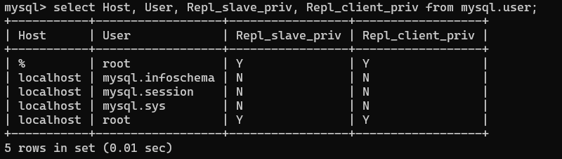
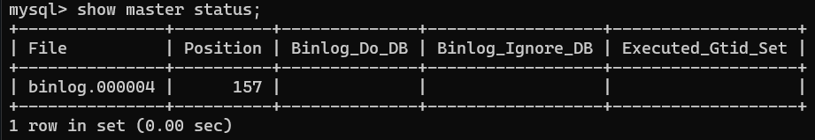

### After deploying a master and slave container...

We have to actually tell one of the database servers(containers) to be the replica and the master.

todo image here

**In the container that we want to be the master, assuming its name is 'master':**
- `docker exec -it master bash`  
- `mysql -u root -p`

We have to grant a specific [mysql priviledge](https://dev.mysql.com/doc/refman/8.4/en/privileges-provided.html#priv_replication-slave) called "REPLICATION SLAVE" to the mysql user. For the _root_ user we already have both:  


(note: Repl_slave_priv is for the master server, Repl_client_priv is for the replica/slave server. root user have both priviledge )

Instead of root user, we could do this with a new user 'repl':
```sql
CREATE USER 'repl'@'%' IDENTIFIED BY 'password';
GRANT REPLICATION SLAVE ON *.* TO 'repl'@'%';
FLUSH PRIVILEGES;
```  

`SHOW MASTER STATUS` will reveal some config that we have to use when configuring our replica/slave server.



**In the container that we want to be the slave, assuming its name is 'replica':**  

`CHANGE MASTER TO MASTER_HOST='master', MASTER_USER='root', MASTER_PASSWORD='root', MASTER_LOG_FILE='binlog.000004', MASTER_LOG_POS=157;`  

Now, `SHOW SLAVE STATUS` will have a table showing some info.

We had already created a database called world _before configuring_. Only new changes on the master will be synced.  
We have to move old data manually
- Using the Clone plugin, see docs: [Cloning Remote Data](https://dev.mysql.com/doc/refman/8.0/en/clone-plugin-remote.html);  
        - Install clone plugin in **both** the donor(master) and the recipient(replica):
            `INSTALL PLUGIN clone SONAME 'mysql_clone.so';`  
            - Check if 'clone' plugin exists: `SELECT PLUGIN_NAME, PLUGIN_STATUS FROM INFORMATION_SCHEMA.PLUGINS`  
            - ~~Restart the donor(master) container manually: `docker restart master`~~  
        - ""By default, a remote cloning operation removes user-created data (schemas, tables, tablespaces) and binary logs from the recipient data directory before cloning data from the donor MySQL Server instance. By cloning to a '[named directory](https://dev.mysql.com/doc/refman/8.0/en/clone-plugin-remote.html#:~:text=Cloning%20Operations%E2%80%9D.-,Cloning%20to%20a%20Named%20Directory,-By%20default%2C%20a)', you can avoid removing data from the current recipient data directory.""
        - `SHOW VARIABLES LIKE 'clone_valid_donor_list';`
        - `SET GLOBAL clone_valid_donor_list = 'master:3306';`
        - Run clone operation from master to slave:`CLONE INSTANCE FROM 'root'@'master':3306 IDENTIFIED BY 'root';`
        ```
    - Or, use `mysqldump` command


