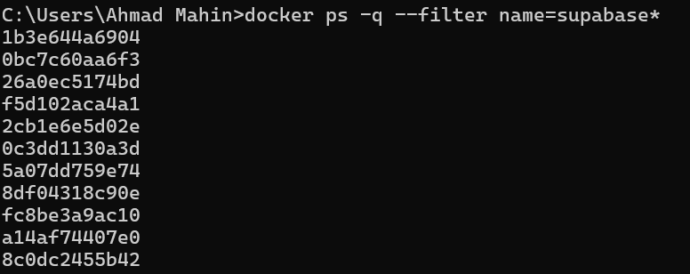
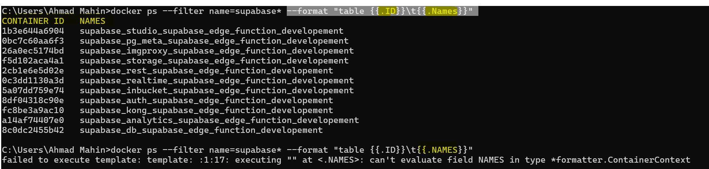
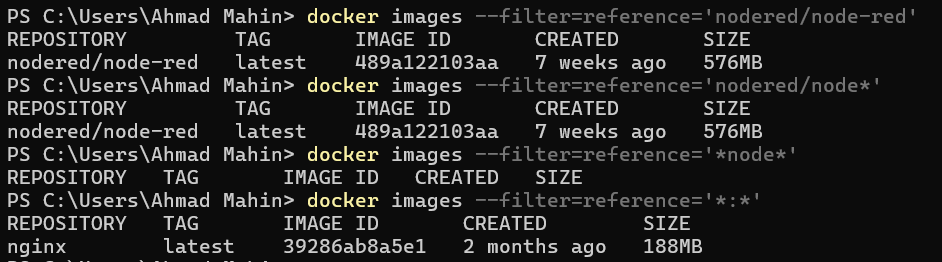
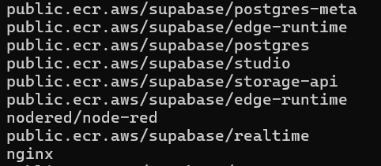
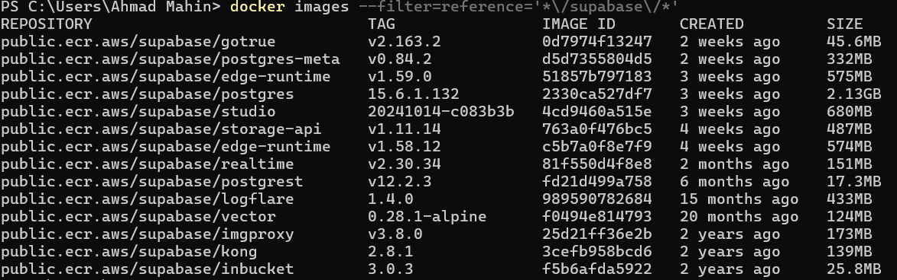
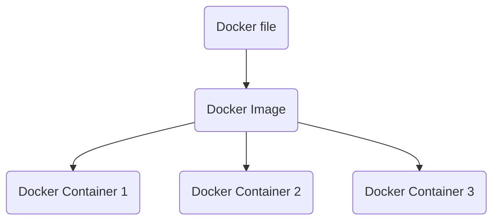

## Why use a container engine( Docker, [Podman](https://docs.podman.io/en/latest/index.html) ) **instead of** traditional Virtual Machine( via VMWare, Virtualbox) ?
**=>**
Goal: Seperate the different concerns of a project (front-end, backend, database).

In traditional approach each app needs a seperate guest-os, meaning more overhead, resource-lock etc. (todo)  
But in Containers approach, a 'container engine' seperates the concerns such as 'each app and its package' can be seperated and still can have what it needs(abstractions, api calls)

`docker run nginx`

=> This will download(if not found in local cache) **nginx image** from docker hub, **create and run a new container** . This will _start_ an nginx server(default port 80). But in browser _localhost:80_ will not work. We need to expose our local machine's port that will point to Docker instance.

`docker ps`  
this is a 'task manager' for docker. Shows _running_ instances.

`docker ps -a`  
Shows history of all container apps...  

`docker logs NAME` or `docker logs -f NAME`  
=> This will output the logs of a running container named NAME. Use -f flag to stream the logs continuously.

`docker run -p 5000:80 nginx`  
Connect host computer's port 5000 to the exposed internal port 80 (from nginx' docs, we know its port is 80)

**Most Used**  
`docker run -it nodered/node-red --name noderedd -p 1880:1880 -anotherHostPort:anotherInternalPort -v node_red_docker_data:/data  `  
- _--name noderedd_ : the container is given a name
- Here the image is _nodered/node-red_ (downloaded from docker hub)
- -v node_red_docker_data:/data => The _data_ folder inside the container is mounted to a folder named _node-red_docker_data_. The named volume is found here: **\\wsl$\docker-desktop\mnt\docker-desktop-disk\data\docker\volumes** !

  

- **-it flag**
    >-i or --interactive:  
    When you type docker run -i this means that your terminal will transfer your input to container (app in container) until you press ctrl-D (leave container). For example, if some app works in container that waits for user input you can type something and that will be forwarded to the app.  
    -t or -tty (Pseudo-TTY):  
    If you add this flag, your container's output is attached to your terminal. Seems it mostly about formatting output (for bin/bash, for example - try ls with and without -t flag), but sometimes is more important because some apps change their behaviour depending on being launched via terminal or not (text editors, for example, or mechanism of masking password with * implemented by terminal).  

**Stop, Remove Image and Container**  

We have to specify the containerID or Container Name or the Image ID
`docker ps` or `docker container ls` gives us containerID and NAME. 
`docker images` or `docker image ls` gives us ImageID.

**To remove a container, first we have to stop it:**
`docker kill NAME` or `docker stop NAME`  
=>Forcefully shuts down Immediately(SIGKILL signal) **or** stop gracefully(SIGTERM, 10sec later SIGKILL) the container with name NAME.
We have to run `docker ps` and know its NAME(far-right) column.  
 
`docker rm <container_id>`  
Removes a stopped container

`docker rm -f <container_id>`  
Forces the removal of a running container (uses SIGKILL)

`docker rmi <image_id>`  
Removes an image. Will fail if there is a running instance of that image i.e. container

`docker rmi -f <image_id>`  
Forces removal of image even if it is referenced in multiple repositories, i.e. same image id given multiple names/tags. Will still fail if there is a docker container referencing image  

  
**Combine docker ls and remove commands: Removing mutliple image/containers**

if there are 3 test nginx containers and all of them have "nginx" in their verbose names.=>  
`docker container stop $(docker container ls -q --filter name=*nginx*)`. **Works in powershell only, $() not supported in cmd**  

**Use Case**  
The following container are running and needs to forefully shutdown and the images removed.

`docker ps -q --filter name=supabase*`  
Applies filter on NAMES column, this command will only print the containerID column because of -q(quiet) flag

`docker ps --filter name=supabase* --format "table {{.ID}}\t{{.Names}}"`  
We can also omit quiet flag and use --format.  
[docs about format flag](https://docs.docker.com/engine/cli/formatting/#json)  
[docs about filter flag](https://docs.docker.com/reference/cli/docker/container/ls/#filter)  

To simply stop all containers: `docker kill $(docker ps -q)`. **Works in powershell only, \$() not supported in cmd**  
Then remove all 'supabase' containers: `docker rm $(docker ps -aq --filter name=supabase*)`  
  

**To remove all images:**  
There is a catch. first we cannot use the 'repository' column name in the filter, we can use 'reference' instead,we can mention repository field and the tag field as well. Secondly, the filter wildcard is not working as expected...  

It seems that wildcards are not working as expected. But only specifying * and nothing else shows 'nginx'.  
The catch is that if repository contains a slash, we have to include this in the search pattern. [see relevent github comment](https://github.com/docker/cli/issues/1332#issuecomment-441082261)

The supabase imamges have 2 slash, nginx has 0 slash, thats why it matched, and all other did not.  
  

`docker images --filter=reference='*\/supabase\/*'` Note: the slash **/** have been escaped with a backslash **\\**  
And finally delete the images in _windows powershell_ with `docker rmi $(docker images -q --filter=reference='*\/supabase\/*')`

**Real Life Use Case**  
When developing a node.js application of which we expose a port when writing the express.js code, for example `app.listen(3000)`,  
we can deploy our existing code-base and run in docker, a **node** image is available in Docker Hub.

