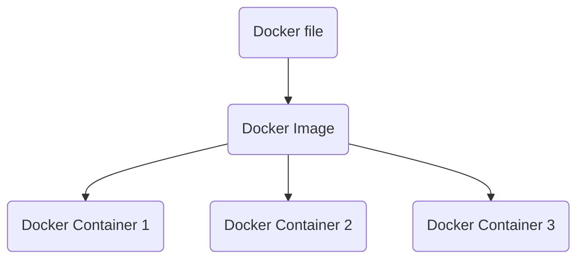

## Why use a container engine( Docker, [Podman](https://docs.podman.io/en/latest/index.html) ) **instead of** traditional Virtual Machine( via VMWare, Virtualbox) ?
**=>**
Goal: Seperate the different concerns of a project (front-end, backend, database).

In traditional approach each app needs a seperate guest-os, meaning more overhead, resource-lock etc. (todo)  
But in Containers approach, a 'container engine' seperates the concerns such as 'each app and its package' can be seperated and still can have what it needs(abstractions, api calls)

`docker run nginx`

=> This will download(if not found in local cache) **nginx image** from docker hub, **create and run a new container** . This will _start_ an nginx server(default port 80). But in browser _localhost:80_ will not work. We need to expose our local machine's port that will point to Docker instance.

`docker kill NAME` or `docker stop NAME`  
=>Forcefully shuts down Immediately(SIGKILL signal) **or** stop gracefully(SIGTERM, 10sec later SIGKILL) the container with name NAME.
We have to run `docker ps` and know its NAME(far-right) column. 

`docker ps`  
this is a 'task manager' for docker. Shows _running_ instances.

`docker ps -a`  
Shows history of all container apps...  

`docker logs NAME` or `docker logs -f NAME`  
=> This will output the logs. Use -f flag to stream the logs continuously.

`docker run -p 5000:80 nginx`  
Connect host computer's port 5000 to the exposed internal port 80 (from nginx' docs, we know its port is 80)

**Most Used**
`docker run -it -p 1880:1880 -v node_red_docker_data:/data --name noderedd nodered/node-red`  
- the container is given a name _--name noderedd_.
- Here the image is _nodered/node-red_ (downloaded from docker hub)
- The data is mounted to a volume named _node-red_docker_data_. The named volume is found here: **\\wsl$\docker-desktop\mnt\docker-desktop-disk\data\docker\volumes** !

- **-it flag**
    >-i or --interactive:
    When you type docker run -i this means that your terminal will transfer your input to container (app in container) until you press ctrl-D (leave container). For example, if some app works in container that waits for user input you can type something and that will be forwarded to the app.
    -t or -tty (Pseudo-TTY):
    If you add this flag, your container's output is attached to your terminal. Seems it mostly about formatting output (for bin/bash, for example - try ls with and without -t flag), but sometimes is more important because some apps change their behaviour depending on being launched via terminal or not (text editors, for example, or mechanism of masking password with * implemented by terminal).
    

**Real Life Use Case**  
When developing a node.js application of which we expose a port when writing the express.js code for example `app.listen(3000)`,  
we can deploy our existing code-base and run in docker, a **node** image is available in Docker Hub.

