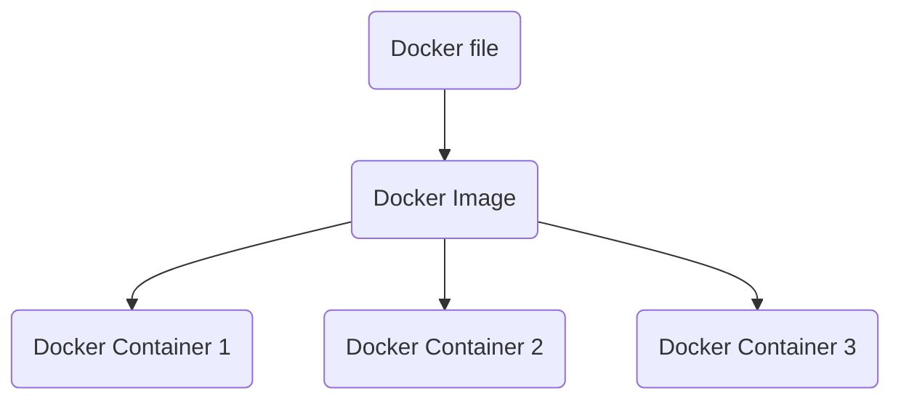

## Why use a container engine( Docker, [Podman](https://docs.podman.io/en/latest/index.html) ) **instead of** traditional Virtual Machine( via VMWare, Virtualbox) ?
**=>**
Goal: Seperate the different concerns of a project (front-end, backend, database).

In traditional approach each app needs a seperate guest-os, meaning more overhead, resource-lock etc. (todo)  
But in Containers approach, a 'container engine' seperates the concerns such as 'each app and its package' can be seperated and still can have what it needs(abstractions, api calls)

`docker run nginx`

=> this will _start_ an nginx server(default port 80). But in browser _localhost:80_ will not work. We need to forward ports from inside Docker instance _to_ our host machine.

`docker run -p 5000:80 nginx`  
This is expose host's 5000 port to the docker nginx instance's 80 port

`docker ps`  
this is a 'task manager' for docker. Shows running instances.

`docker ps -a`  
Shows history of previously run container apps...

