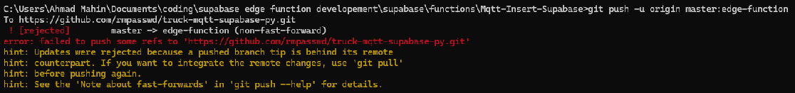
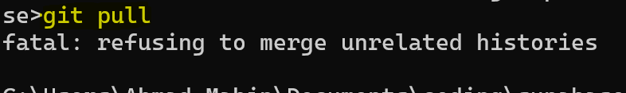

### Scenario: Working in a local environment with git. It has 'master' branch. In a Github remote repo, there are 2 'main' and 'live' branch. Need to push local files to 'live' branch, also remove existing files in 'live' branch

- To see the files currently being tracked with git: `git ls-tree -r master --name-only`
- Git has 'master' branch, Github has 'main'

`git remote show` to see whether the local repo has any remote 'origin'. If the output is empty, that means there are no such thing as 'origin'.  

To link a remote repo(eg. from Github): `git remote add "origin" https://github.com/username/repo-clone-url.git`  

Note that there can be >1 link, thus the 'add' syntax.  now the previous command will output 'origin'. To see list of urls the local repo links to(sync to): `git remote get-url origin` with `git remote show` 

`git push --force` wont work if the local branch name and remote branch names are different.

To push to specific remote branch:  
`git push -u origin master:live`

Alternate:   
Use`git branch --set-upstream-to=origin/live` to set the upstream-branch explicitly so that in future we can just use `git push` instead of `git push -u origin master:live`

**Possible Issues:**  
**This happens when we do not `git pull` before `git push` =>**
  
  
**This happens when the local repo and remote repo are completely unrelated, different works...**

If we are looking to replace everything in remote, then use --force flag when pushing, no need to pull.
git push -u origin master:live --force

